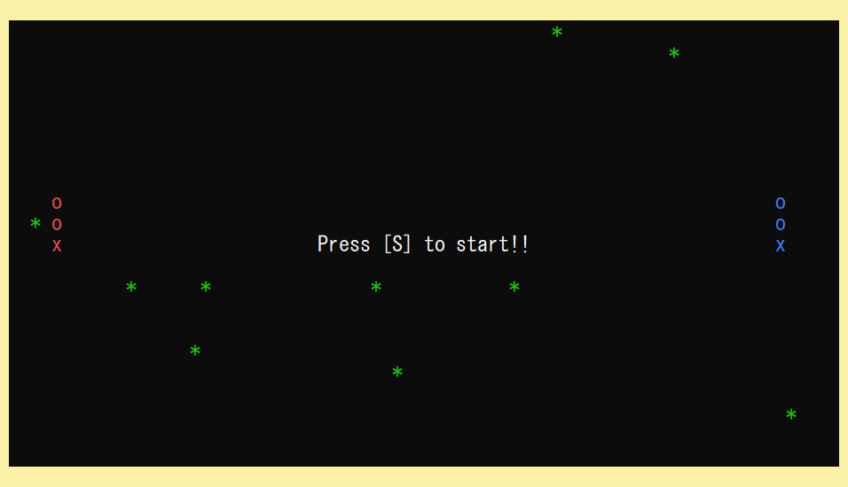

# Viper Game

## 環境
- windows 11
- C++14
- Visual Studio 2022

## 実行方法
ViperGame.exeを起動

## ゲーム画面

## ルール
### 勝利条件
- エサ(*)を食べて、身体の長さを20にすると勝利
- 制限時間が過ぎた後、相手より身体が長いと勝利

### 敗北条件
- 壁にぶつかる
- 相手にぶつかる
- 相手の毒に触れる
- 自分の身体にぶつかる

### その他
- 当たり判定は全て頭
- 毒は自分の身体を消費して発射する(身体が短くなる)
- 進行方向の逆方向には進むことができない

## 操作方法
### player1(赤)

- 移動: WASD(上左下右)
- 毒発射: F
- 毒停止: C

### player2(青)

- 移動: IJKL(上左下右)
- 毒発射: H
- 毒停止: N